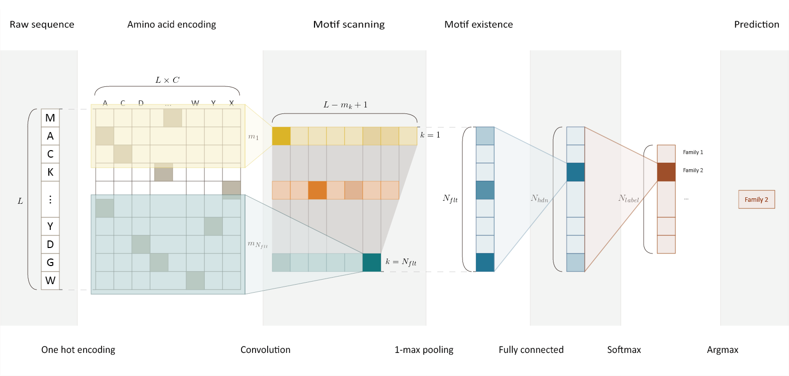

# DeepFam

DeepFam is a deep learning based alignment-free protein function prediction method. DeepFam first extracts motif-like features from a raw sequence in convolution layer and make a prediction based on the features.

